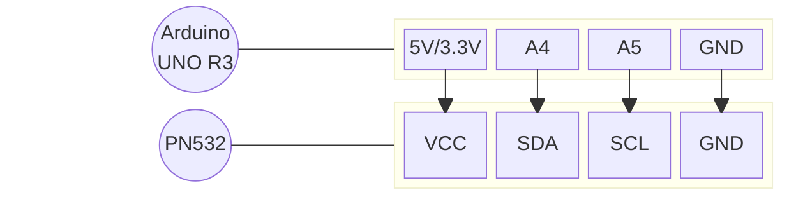

# NFC - Reader & Writer

Using Arduino Uno R3 and module PN532

## Connection diagram

```mermaid
block
columns 2
    
    ar(("Arduino\nUNO R3"))
    block:ARDUINO
        A["5V/3.3V"]
        B["A4"]
        C["A5"]
        D["GND"]
    end

    pn(("PN532"))
    block:PN532
        E["VCC"]
        F["SDA"]
        G["SCL"]
        H["GND"]
    end

    ar --- ARDUINO
    pn --- PN532

    A --> E
    B --> F
    C --> G
    D --> H
```